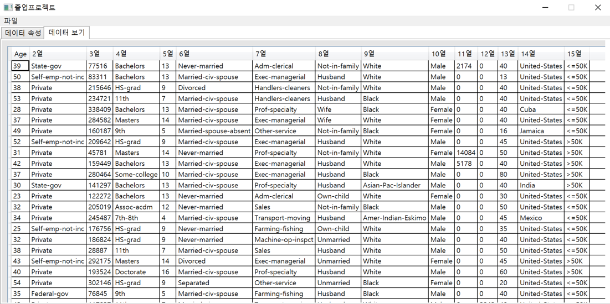
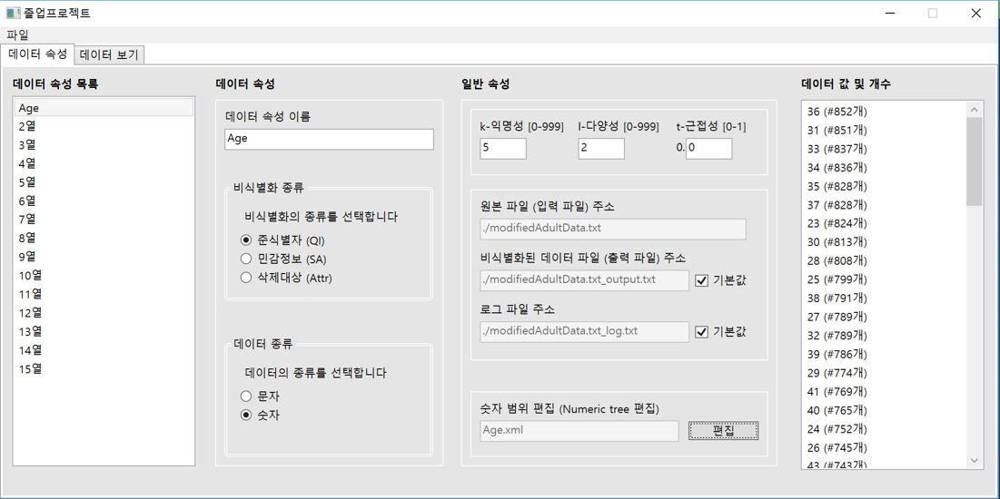
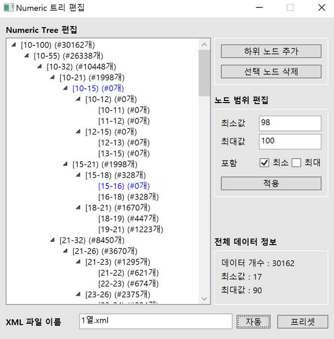
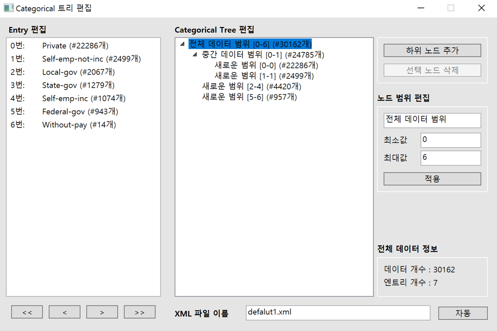
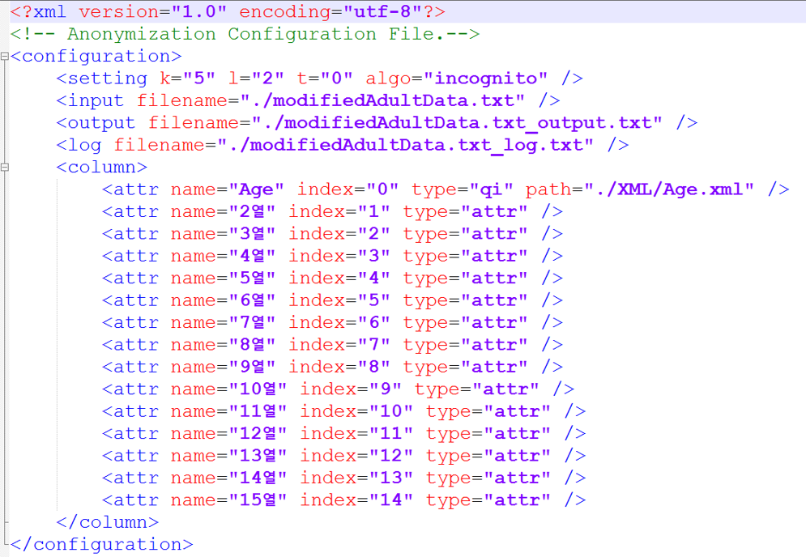

# [개인] 데이터 비식별화 툴의 어드민 개발 프로젝트

**진행 기간**: 2016. 09. ~ 2016. 12.

**사용 언어/기술**: C#, wpf

## 소개

데이터 비식별화 툴인 Incognito_KLT에 사용할 설정들 및 범주 트리를 생성하는 window 앱.

`범주트리: 노드는 데이터의 범위를 나타냄. 하위 노드로 내려갈수록 더 자세한 범위를 갖는다.`

### 주요 기능
- 원본데이터 출력: 입력할 데이터들을 테이블 형태로 출력
- 컬럼 별로 비식별화 설정
  - 데이터의 분포를 보면서, 비식별화에 적용할 범위 트리를 설정할 수 있음.
  - 비식별화 종류 선택
  - 그외 비식별화 관련 config 값 설정

## 스크린샷

원본 데이터들을 테이블 형태로 확인 가능

각 컬럼 별로 비식별화 config 값 설정하는 화면

나이와 같은 숫자 타입의 범주 트리를 생성하는 화면

문자 타입의 범주 트리를 생성하는 화면

설정 값을 저장한 xml파일 예시

